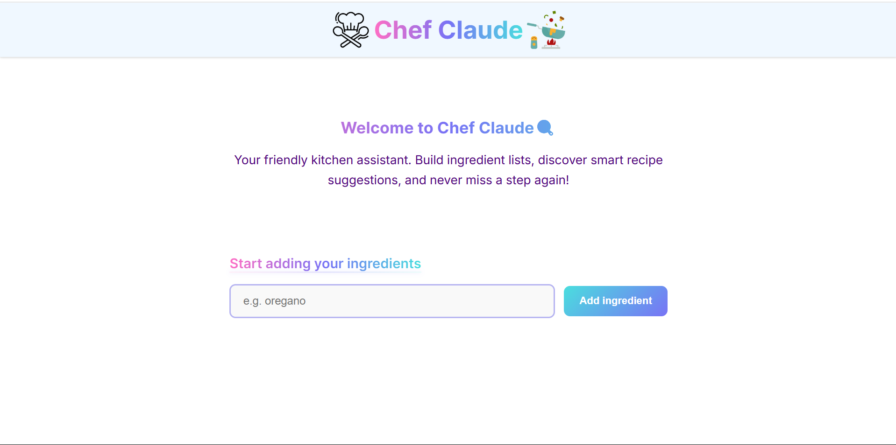
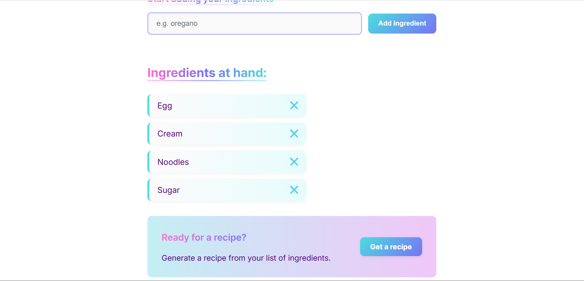
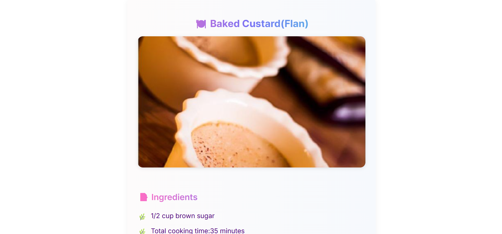
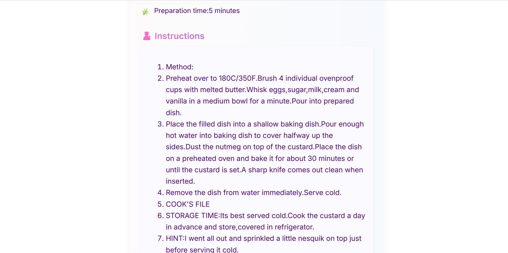

# 👨‍🍳 Chef Claude — Smart Ingredient-Based Recipe Generator

Welcome to **Chef Claude** — a smart, minimal, and colourful web app that helps you turn the ingredients you have into delicious recipes 🍽️







---

## 🔍 Features

- 📝 Add ingredients you have at home
- 🧠 Get AI-suggested recipes using those ingredients
- 🧾 View full instructions, ingredients, and image of the dish
- 🌈 Clean, gradient-inspired modern UI built with React
- 🌐 Powered by [Spoonacular API](https://spoonacular.com/food-api)

---

## 🚀 Live Demo

Try it out here:  
👉 [https://chefclaude3.netlify.app/](https://chefclaude3.netlify.app/)

---

## 🧰 Tech Stack

- ⚛️ React (with functional components & hooks)
- 💅 CSS3 (custom pastel UI)
- 🔗 Spoonacular Recipe API
- 💡 Vite (or CRA) for fast dev experience

---

## 🛠️ Getting Started

To run the project locally:

### 1. Clone the repo:

```bash
git clone https://github.com/yourusername/chef-claude.git
cd chef-claude
npm install
```

### 2. Create a `.env` file in the project root:

```
VITE_SPOONACULAR_API_KEY=your_spoonacular_api_key_here
```

### 3. Start the development server:

```bash
npm run dev
```

---

### 📁 Folder Structure

```

src/
├── assets/
├── components/ # React components
│ ├── MainBody.jsx
│ ├── IngredientsLists.jsx
│ └── Recipe.jsx
├── api.js # API utility function
├── App.jsx
├── index.css
├── main.jsx
├── index.html
.
.
.

```
---

## 📄 License

This project is licensed under the **MIT License** — feel free to use, modify, and share it.

